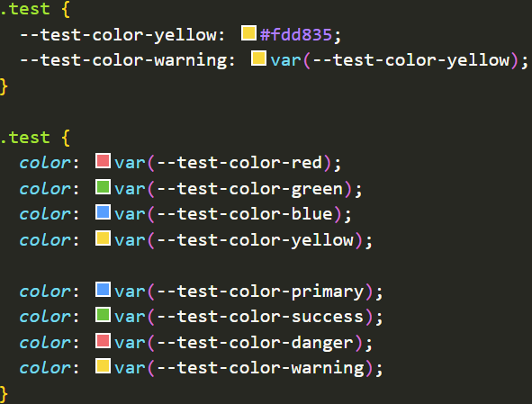

# vscode-ext-color-highlight

VS Code 颜色高亮插件，支持全局变量



## Configuration

```json
{
  "color-highlight.globalPaths": ["./src/styles/variables-define.scss"],
  "color-highlight.markerType": "dot-before",
  "editor.colorDecorators": false
}
```
